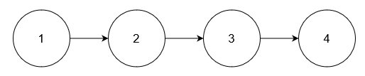

# **Delete Nodes From Linked List Present in Array**
## **Problem link**
https://leetcode.com/problems/delete-nodes-from-linked-list-present-in-array/ 

## **Descritprion**
**Example 1:**

Input: nums = [1,2,3], head = [1,2,3,4,5] 

Output: [4,5] 

Explanation: 
 
Remove the nodes with values 1, 2, and 3.  

**Example 2:**

Input: nums = [1], head = [1,2,1,2,1,2] 

Output: [2,2,2] 

Explanation: 
 
Remove the nodes with value 1.  

**Example 3:**

Input: nums = [5], head = [1,2,3,4] 

Output: [1,2,3,4] 

Explanation: 
 
No node has value 5.  

 

**Constraints:**

1 <= nums.length <= $10^{5}$ 
1 <= nums[i] <= $10^{5}$ 
All elements in nums are unique. 
The number of nodes in the given list is in the range [1, $10^{5}$]. 
1 <= Node.val <= $10^{5}$ 
The input is generated such that there is at least one node in the linked list that has a value not present in nums. 

## **Solution**
We need to traverse the linked list and remove any number exists in the input array. 
this can be done easliy by traversing the nodes and for each node we will traverse the input array to check if the value exists in the array or not. 
This solution will be valid but it will not be efficet and it will result in O(nodes_count * array_elements_count). 
This can be enhanced if we used Hash Set to store the array elements and access the elements in a constant time. 
### Approach (Hash Set)
-   Hash Set will be used to store **nums** elements.
-   We will iterate through the List and if we found a node have value exists in Hash Set, we will remove the node.
-   if the node to be removed is the first node, simply we will shift the head to the next node and remove the first node.
-   if the node to be removed is not the head we will make the previous(we must track the previous node) node points to the node next to the node to be removed then we will remove the node.

#### **Complexity** 

##### **Time complexity:** 
O(nodes_count + array_elements_count) 

##### **Space complexity:**
O(array_elements_count). 
