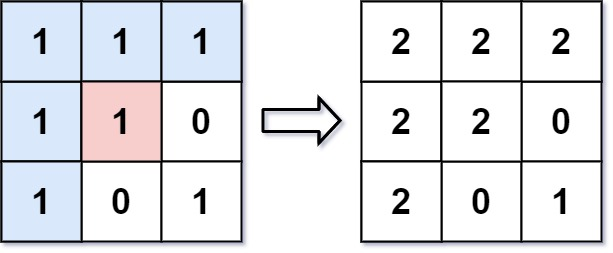

# **Flood Fill**
## **Problem link**
https://leetcode.com/problems/flood-fill  

## **Descritprion**
An image is represented by an m x n integer grid image where image[i][j] represents the pixel value of the image. 

You are also given three integers sr, sc, and color. You should perform a flood fill on the image starting from the pixel image[sr][sc]. 

To perform a flood fill, consider the starting pixel, plus any pixels connected 4-directionally to the starting pixel of the same color as the starting pixel, plus any pixels connected 4-directionally to those pixels (also with the same color), and so on. Replace the color of all of the aforementioned pixels with color. 

Return the modified image after performing the flood fill. 

 

**Example 1:** 
 
**Input:** image = [ [1,1,1], [1,1,0], [1,0,1] ], sr = 1, sc = 1, color = 2 
**Output:** [ [2,2,2], [2,2,0], [2,0,1] ] 
**Explanation:** From the center of the image with position (sr, sc) = (1, 1) (i.e., the red pixel), all pixels connected by a path of the same color as the starting pixel (i.e., the blue pixels) are colored with the new color. 
Note the bottom corner is not colored 2, because it is not 4-directionally connected to the starting pixel.  
**Example 2:** 

**Input:** image = [ [0,0,0], [0,0,0] ], sr = 0, sc = 0, color = 0 
**Output:** [ [0,0,0], [0,0,0] ] 
**Explanation:** The starting pixel is already colored 0, so no changes are made to the image.  
**Constraints:** 
- m == image.length
- n == image[i].length
- 1 <= m, n <= 50
- 0 <= image[i][j], color < 216
- 0 <= sr < m
- 0 <= sc < n
## **Solution**
This problem can be solved using different algorithms like BFS, DFS and we will use recursive DFS algorithm 
we will start traversing from position(sr,sc) and update the pixel color then, we will traverse the pixels connected 4-directionally to that pixel then traverse each 4 pixels connected 4-directionally to these pixels and do that again and again recursively  
### Approach (recursive DFS)
- I used a helper function called **floodFillDfs** to handle the recursion operation and this function takes the following arguments: 
    - image(passed by reference to be edited in place)
    - row index(sr)
    - column index(sc)
    - starting pixel color
    - the new color to be applied to the pixels.
- recursion operation is as follows:
    - **base state 1:** if the pixel position is outside the image ,the recursion operation will stop
    - **base state 2:** if the pixel dont have the same color as the starting pixel the recursion operation will stop as it's not required to do any actions for that pixel
    - **recursive state:** if the pixel have the same color as the starting pixel, the pixel color is changed and the positions of the 4-directionally connected pixels will be passed to the **floodFillDfs**

#### **Complexity**
##### **Time complexity:** 
O(n*m) in the worst case(if all the pixels have the color that need to be changed). 

##### **Space complexity:**
O(1) image is edited in place. 
