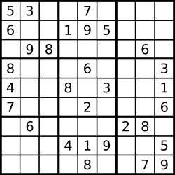

# **Valid Sudoku**
## **Problem link**
https://leetcode.com/problems/valid-sudoku/ 

## **Descritprion**
Determine if a 9 x 9 Sudoku board is valid. Only the filled cells need to be validated according to the following rules: 

Each row must contain the digits 1-9 without repetition. 
Each column must contain the digits 1-9 without repetition. 
Each of the nine 3 x 3 sub-boxes of the grid must contain the digits 1-9 without repetition. 
**Note:** 

A Sudoku board (partially filled) could be valid but is not necessarily solvable. 
Only the filled cells need to be validated according to the mentioned rules. 
 

**Example 1:** 
 
**Input:** board =  
[[ "5", "3", ".", ".", "7", ".", ".", ".", "." ] 
,[ "6", ".", ".", "1", "9", "5", ".", ".", "." ] 
,[ ".", "9", "8", ".", ".", ".", ".", "6", "." ] 
,[ "8", ".", ".", ".", "6", ".", ".", ".", "3" ] 
,[ "4", ".", ".", "8", ".", "3", ".", ".", "1" ] 
,[ "7", ".", ".", ".", "2", ".", ".", ".", "6" ] 
,[ ".", "6", ".", ".", ".", ".", "2", "8", "." ] 
,[ ".", ".", ".", "4", "1", "9", ".", ".", "5" ] 
,[ ".", ".", ".", ".", "8", ".", ".", "7", "9" ]] 
**Output:** true 

**Example 2:** 
Input: board =  
[[ "8", "3", ".", ".", "7", ".", ".", ".", "." ] 
,[ "6", ".", ".", "1", "9", "5", ".", ".", "." ] 
,[ ".", "9", "8", ".", ".", ".", ".", "6", "." ] 
,[ "8", ".", ".", ".", "6", ".", ".", ".", "3" ] 
,[ "4", ".", ".", "8", ".", "3", ".", ".", "1" ] 
,[ "7", ".", ".", ".", "2", ".", ".", ".", "6" ] 
,[ ".", "6", ".", ".", ".", ".", "2", "8", "." ] 
,[ ".", ".", ".", "4", "1", "9", ".", ".", "5" ] 
,[ ".", ".", ".", ".", "8", ".", ".", "7", "9" ]] 
**Output:** false 
Explanation: Same as Example 1, except with the 5 in the top left corner being modified to 8. Since there are two 8's in the top left 3x3 sub-box, it is invalid. 
 

**Constraints:** 

board.length == 9 
board[ i ].length == 9 
board[ i ][ j ] is a digit 1-9 or ' . '. 

## **Solution**
The most easy way to solve this problem is to brute force each row, column and sub box using two loops and check for repeated numbers. 
To enhance this solution we will use Hash set to use one loop to check each row, column, sub box. 
There is solution can be enhanced by using dynamic programming to store output of the repeated calcuation ,you can check how dynamic programming works to find out how to apply it on this problem. 
### Approach (Hash Set)
Hash sets have almost constant access time so for example, we can traverse a row using a loop and for each iteration we will check if the current element is in the set or not:
- if the number is exists in the set that means that this is the appearance for this number.
- if the number is not in the set, we will insert it and continue to traverse the rest of the row.
- We will do the same steps with the columns and the sub boxes to check for the repeated numbers.
- Input traversing will be using one loop and for each iteration we will check one row, one column and one sub box.

#### **Complexity** 
**note:** n is constant number= 9 * 9 

##### **Time complexity:** 
O(3*n) = (3 * 9 * 9) 

##### **Space complexity:**
O(3n) = (3 * 9 * 9). 
